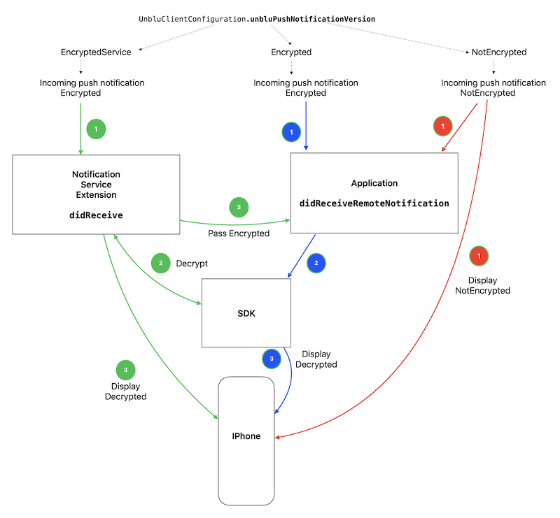

# Demo app showing how to work with Unblu SDK with push notifications

# Installing

The Unblu SDK is added via Swift PM.

1. "pod install" in the directory to add the Firebase frameworks.
2. Add GoogleService-Info.plist.
3. Change package identifier in Xcode.
3. Set the server URL and server key in AppDelegate.swift.

# Notification Service extension

The appendix contains an example implementation of identity service extensions.

For additinal information about , refer to  [Notification service extension]
(https://www.unblu.com/en/docs/latest/knowledge-base/mobile/ios/ios-integration.html#notification-service-extension).

# Procedure for processing push notifications

